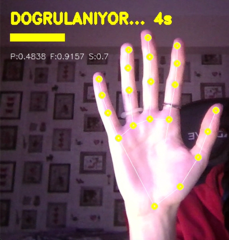
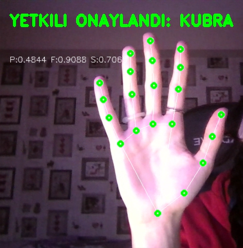
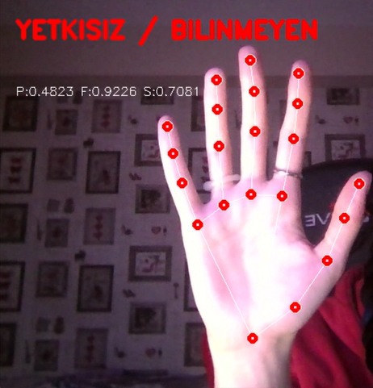

# Adli Biyometrik El Tanıma ve Çok Katmanlı Güvenlik Sistemi

Bu proje, temassız el geometrisi analizi, dijital delil mühürleme ve MFA
katmanlarını birleştiren bir güvenlik prototipidir.

## Özellikler

- **Biyometrik Oran Analizi:** Mediapipe Landmark teknolojisi kullanılarak elin 21 eklem noktası üzerinden kişiye özel P (Avuç), F (Parmak) ve S (Serçe) oranları hesaplanır.
- **Adli Kanıt Mühürleme (SHA-256):** Sisteme yapılan her giriş teşebbüsü, o anki kamera görüntüsüyle birlikte kaydedilir. Her bir görsel ve log satırı, veri bütünlüğünü kanıtlamak amacıyla SHA-256 algoritması ile dijital olarak mühürlenir.
- **MFA (Multi-Factor Authentication):** Biyometrik doğrulama sonrası Google Authenticator entegrasyonu ile 6 haneli zamana duyarlı şifre doğrulaması istenir.
- **Adli Loglama:** Günlük bazda oluşturulan klasörleme yapısı ve detaylı CSV raporlama ile olay müdahalesi (Incident Response) kolaylaştırılır.

## Kurulum ve Kullanım

1. Gereksinimlerin yüklenmesi:
   pip install opencv-python mediapipe numpy pyotp qrcode hashlib

2. MFA Yapılandırması (İlk Kez Kullanacaklar İçin):
Kodun içindeki SECRET_KEY değişkenini kullanarak telefonunuza bir doğrulayıcı eklemelisiniz:
Google Authenticator uygulamasını açın.
"Kurulum Anahtarı Gir" seçeneğine tıklayın.
Anahtar kısmına kodda tanımlı olan JBSWY3DPEHPK3PXP değerini girin.
Artık telefonunuz her 30 saniyede bir 6 haneli kod üretecektir.

3. Sistemin Başlatılması:
   python main.py

4. Doğrulama Süreci
Biyometrik Aşama: Kameraya elinizi gösterin. Sistem elinizi tanıdığında sarı bir ilerleme çubuğu çıkacaktır. Elinizi 5 saniye boyunca sabit tutun.
MFA Aşaması: Biyometrik onay alındığında terminalde MFA KODU: uyarısı çıkacaktır. Telefonunuzdaki 6 haneli güncel kodu buraya yazıp Enter tuşuna basın.
Erişim: Kod doğruysa ekranda yeşil renkte "ERISIM YETKISI: KUBRA MERDE" yazısı belirecek ve sistem yetkili girişi olarak mühürlenecektir.

5. Adli Kayıtların İncelenmesi
İşlem tamamlandığında kanitlar/ klasörü otomatik olarak oluşturulur:
Görsel Kanıt: ONAY_XXXX.jpg veya IHLAL_XXXX.jpg dosyalarını inceleyin.
Dijital İz: adli_loglar.csv dosyasını açarak giriş denemesinin saatini, biyometrik oranlarını ve SHA-256 Hash mühürünü kontrol edin.

Not: Sistemi kapatmak için kamera penceresi odaktayken klavyeden 'q' tuşuna basmanız yeterlidir.

## Sistem Ekran Görüntüleri

Sistemin farklı durumlar altındaki analitik çıktıları aşağıda sunulmuştur:

| Doğrulama Süreci | Onaylı Erişim (Yetkili) | İhlal Durumu (Yetkisiz) |
| :---: | :---: | :---: |
|  |  |  |
| *5 Saniyelik Liveness Check* | *Yeşil Biyometrik Onay* | *Kırmızı İhlal Uyarısı* |
